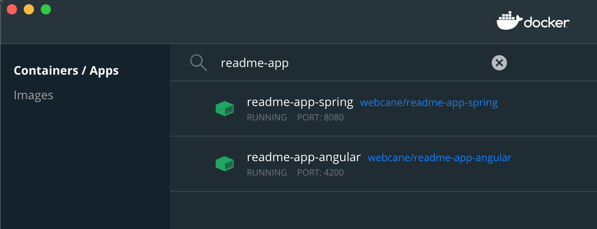
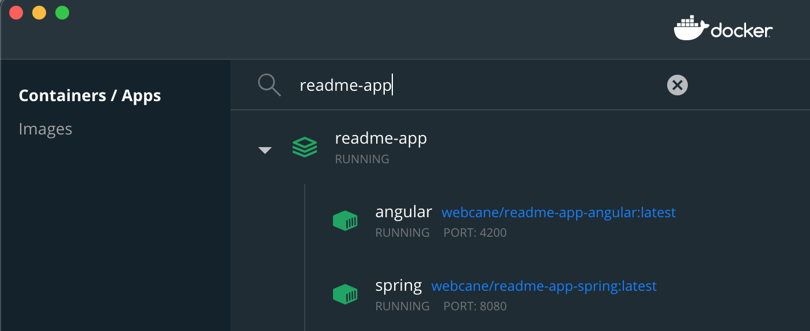

# Readme App

## Introduction

Web application which holds and manages articles to read out.

## Microservice endpoints

Below you can find endpoints exposed by this microservice.

### Online API documentation

* [API](http://localhost:8080/swagger)
* [UI](http://localhost:8080/swagger-ui)

### Management endpoints

* [Management](http://localhost:8080/management)
* [Actuator](http://localhost:8080/management/actuator)
* [Info](http://localhost:8080/management/info)
* [Health](http://localhost:8080/management/health)
* [Metrics](http://localhost:8080/management/metrics)
* [Autoconfig](http://localhost:8080/management/autoconfig)
* [Beans](http://localhost:8080/management/beans)
* [Configprops](http://localhost:8080/management/configprops)
* [Mappings](http://localhost:8080/management/mappings)
* [Trace](http://localhost:8080/management/trace)

## Running on local machine
### back-end

1. Build with maven
 `mvn package -DskipTests`
 
2. run locally
 `mvn spring-boot:run`
 
3. test locally
 `http://localhost:8080`
 
### front-end
1. switch to angular directory
`cd /angular`

2. download all dependencies
`npm install`

3. run locally
`npm run start`

4. test locally
`http://localhost:4200`

## Containerization
### single container app
#### back-end

1. Build a docker image using Dokerfile:
 `docker build -t webcane/readme-app-spring .`
 
2. Run docker image locally
 `docker run --name readme-app-spring -p 8080:8080 webcane/readme-app-spring` 

#### front-end

1. Build docker image
`docker build -t webcane/readme-app-angular .`

2. Run docker image locally
`docker run --name readme-app-angular -p 4200:80 webcane/readme-app-angular`

#### docker 
 
1. check if docker running
 `docker ps`
 
2. stop the docker image
 `docker stop <container id>`

### multi-container app
Containers, by default, run in isolation and don’t know anything about other processes or containers on the same machine. So, allow one container to talk to another.

#### container networking
1. create docker network
`docker network create readme-app-net`

#### back-end
1. Run docker image
 `docker run --network readme-app-net --network-alias app --name readme-app-spring -p 8080:8080 webcane/readme-app-spring`
 
#### front-end
1. Run docker image
`docker run --network readme-app-net --network-alias ui --name readme-app-angular -p 4200:80 webcane/readme-app-angular`

### Use Docker Compose 
Docker Compose is a tool that was developed to help define and share multi-container applications. 

1. build containers forfirst time
`docker-compose build`

1. start back-end and front-end together
`docker-compose up`

 
## Kubernetes

